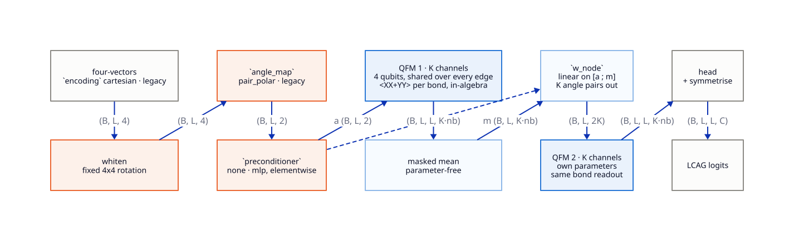

# PartiqleDTR

This repo facilitates to revive the former partiqlegan project.
The goal is to reconstruct intermediate decay products based on simulated decay events as reference data.

Tech stack:
- qml-essentials : for quantum Fourier models and JAX based simulation
- phasespace-jax : JAX port of phasespace, for decay event generation
- JAX : array computation and autodiff
- Flax : neural network modules
- Optax : optimizer and training loop
- Fluksio : data science pipeline and experiment tracking

References (`./reference/`, gitignored symlinks):
- baumbauen: classical gnn based approach with message passing
- partiqlegan: hybrid quantum-classical approach
- reconstructing-paper & improving-paper: paper corresponding to the hybrid approach
- fourier-fingerprints: correlations between frequency components (FCC) of QFMs as an inductive-bias descriptor
- unflattening: latest research concerning input distribution dependence for quantum circuits

Idea:
Create a new approach for the decay tree reconstruction problem by using quantum Fourier models (through `Model` in qml-essentials) in combination with a classical MLP.
This should serve as an application scenario for the `unflattening` paper, where we showed that the input distribution for a data re-uploading model get's whitened for some ansaetze when being combined with an MLP (and whitening is actually preferrable for these ansaetze).
Problem back then was that the simulation of a quantum model took an awful long time and therefore a purely quantum based gnn wasn't feasible.
However we showed that the qnn seems to be beneficial for the training.
While there is a low chance that we can acutally show an advantage compared to the purely classical case, it would already be interesting to research if the trigonometric properties of a QFM fit in the context of this given problem.
This formulates the main hypothesis:
> A constellation of small, shared-weight QFMs embedded in a message-passing architecture, with a constrained elementwise MLP preconditioner, can predict the LCAG of particle decay events.
> On floor-free polynomial-DLA ansaetze the encoder-channel rescue and g-purity dynamics predicted by the unflattening work are observable on naturally clustered kinematic inputs, while floored ansaetze show the predicted indifference.
> The ansatz FCC (fourier-fingerprints) acts as an inductive-bias descriptor for the task.

Measured so far (`docs/RESEARCH.md` §1, §7-8), the first two clauses need amending:

- kinematic inputs are **not** naturally clustered under either sensible encoding;
  the clustered regime is reached only under the prior work's `p*E*pi` encoding,
  which is now a deliberate control arm;
- the rescue is real and reproduces across seeds, but it is **purity recovery, not
  flattening**: the angle law does not become uniform, and the direction of the
  total-variation change is seed-dependent;
- the recovered purity **does not buy reconstruction accuracy**, so the
  contribution is mechanistic rather than a performance claim.

The floored-ansatz clause holds, and sharply: the preconditioner moves the distribution
just as far there, the floor absorbs all of it, and the task gets worse. The FCC
clause is untested -- that is phase 5.

Note:
Fluksio is a relatively new framework (developed by myself).
Documentation is available here: https://docs.fluksio.com/getting-started/data-science/
If we hit any limitations or encounter problems, we should stop and flag them in `docs/NOTEPAD.md` instead of trying workarounds.
Then Fluksio will be fixed and we can continue.
The same holds true for any limitations/issues with qml-essentials.

## Architecture



The classical `gnn` and `mlp` arms take the same features straight into their own
preconditioner and head; only the quantum arm is drawn.

```
partiqledtr/    the model and its data generation -- nothing study-specific
├── data/       topology sampler · decay -> LCAG · features · phasespace generation
│               · dataset assembly + stats · whitening (phase 4)
├── models/     elementwise residual preconditioner · NRI message-passing GNN
│               · linear control · QFM constellation (phase 3)
├── ansaetze.py the ansatz arms and their bond structure (phase 4b arm C)
├── metrics.py  per-element / Perfect-LCAG / valid-tree rate, class weights
├── analysis.py g-purity (product-state + exact) · DLA pre-check · encoding comparison
├── train.py    loss, training loop, checkpoints, fit/evaluate nodes
└── pipeline.py the three Fluksio flows
dev/            the research: one folder per study, plus the engine script
├── serve.sh            the engine, on ./.fluksio with enough runs in flight
├── s1-encoding-purity/ encoding x weight g-purity, before anything trains
└── s2-expressivity/    phase 4b -- the three arms, the sweep, the figures
docs/           the research record, and the diagram above
├── architecture.d2 / .svg
├── ROADMAP.md   the plan and the state of it
├── RESEARCH.md  the measurement history
├── FINDINGS.md  the claims
├── DECISIONS.md why each implementation choice was made
└── NOTEPAD.md   what the tooling cost
tests/          run with `uv run pytest`
```

Everything a run reads or writes sits at the repo root and is gitignored:
`.fluksio/` (the engine's store, its own default location), `data/` (dataset splits
exported from a `generate` run), `results/` (one json per arm), `figures/` and
`logs/`. All of it is reproducible from `generate` plus `dev/`, so none of
it is tracked -- but the research record in `docs/` now is.

The model is a constellation of 4-qubit QFMs used as the *edge function* of a
message-passing network, sharing one parameter set across every edge (which is
what makes it permutation-equivariant). Every classical part is particle-local --
elementwise preconditioner, parameter-free masked mean, per-node linear map -- so
cross-particle structure can only come from the quantum part. Readout is per-qubit
Pauli-Z plus a shared linear head, so nothing scales exponentially.

Three flows: `generate` runs the phase-space simulation once, `train` consumes its
artifacts and is the part a sweep repeats, and `characterize` records what the arms
*are* -- DLA certificates, encoding cells, the sampler's shape ceiling -- without
touching a dataset. Fluksio caches node results on their
inputs, so re-running an unchanged stage is nearly free. `fit` opts out
(`cache=False`, D93): its fingerprint does not cover `train_model`, where the loop
lives, so editing the loop would otherwise replay pre-change numbers silently --
which it did once, and cost a re-run to notice.

**Read `docs/FINDINGS.md` before designing runs** -- it is the current set of claims,
`docs/RESEARCH.md` the measurement history behind them (and it revises one of the
premises above), and `docs/DECISIONS.md` why each implementation choice was made.

## Running the experiments

Prerequisites: `uv sync`, and a Fluksio engine (`dev/serve.sh`, or add `--local`
to any command to boot one in-process). **Run the engine and every script with
`JAX_PLATFORMS=cpu`**: the arrays here are small enough that the GPU loses on both
generation and training, and with a CUDA jaxlib installed the engine's per-node
worker processes fight over the device (`docs/DECISIONS.md` D99). Pass
`--sync partiqledtr` to every `fluksio run`: the default sync root is the whole
directory, which walks the vendored `reference/` checkouts and aborts on a module
name they share, so the flows would silently not be uploaded (`docs/NOTEPAD.md`). Node results are cached on their inputs, so
re-running something unchanged is nearly free; `--no-cache` forces re-execution.

**1. Generate a dataset.** Defaults are 10 topologies *per group* (30 total, in
three known/unknown groups) at 1000 events each:

```sh
fluksio run generate --sync partiqledtr --seed 0 --wait
```

Check the `stats` output before going further: `split_integrity_ok` must be true,
and the angle-marginal figures are the phase-1 evidence. `encoding_report` prices
each candidate encoding in g-purity, which is the measurement behind `docs/RESEARCH.md`
§1 -- read it before choosing an arm.

**2. Train.** A dataset artifact is named on the command line by its digest, or by
the run that made it (`@run:<id>.dataset_train`); `dataset_meta` is a `json` input,
so it still has to be passed inline. The Python API hands both over directly:

```python
from partiqledtr.pipeline import generate, train

data = generate.submit(seed=0).wait().result
data_refs = {k: data[k] for k in ("dataset_train", "dataset_val", "dataset_test", "dataset_meta")}

run = train.submit(
    **data_refs, model="qfm", encoding="cartesian", ansatz="XY_Brickwork", epochs=100
).wait()

print(run.result["dla_report"])  # recorded before training
print(run.result["test_metrics"])  # overall / known / unknown
print(run.metrics("train.g_purity"))  # the phase-4 observable
print(run.metrics("train.mean_sin2"))  # what the angle law is doing (§8)
print(run.result["final_metrics"]["angle_stats_final"])  # per qubit, never pooled
```

The arms, all selected through flow inputs:

| axis | values | notes |
| --- | --- | --- |
| `model` | `gnn`, `mlp`, `qfm` | `qfm` requires `encoding="cartesian"` |
| `ansatz` | `XY_Brickwork`, `XY_Ring`, `XY_AllPairs`, `Circuit_19` | quantum arm only; phase 4b arm C |
| `lr` | float | `1e-2` is where the rescue appears (§7); the default `1e-3` is below it |
| `preconditioner` | `none`, `mlp` | `mlp` is the learned elementwise preconditioner |
| `whiten` | `false`, `true` | fixed isotropic preconditioning |
| `encoding` | `angles`, `cartesian`, `legacy` | `cartesian` keeps `\|p\|`, needed by `qfm` |
| `angle_map` | `pair_polar`, `legacy` | pair with `encoding=legacy` for the clustered arm |
| `n_layers` | int | data-reuploading depth; phase 4b arm A |
| `enc_weights` | `hamming`, `binary`, `ternary`, `ternary_pair` | per-qubit encoding weight; arm B |
| `enc_reupload` | `diagonal`, `cyclic` | which features reach which qubit; arm B |
| `dim`, `n_blocks` | ints | GNN width/depth; use for parameter matching |

`ternary_pair` weights qubit `q` by `3**(q mod 2)`, so the weighting repeats per
particle: it is the only cell that is both dissociated (the spectral-preconditioning
condition) and invariant under the endpoint swap, which is what lets arm B compose
with a partition-respecting ansatz instead of undoing it (`docs/DECISIONS.md` D100).

`Matchgate` is retired as a reported arm -- `XY_AllPairs` took over its floored
role and respects the two-particle partition as well -- but it stays runnable, so
the phase-4 cells of `docs/RESEARCH.md` §7 remain reproducible.

The ROADMAP's three phase-4 input arms are `preconditioner=none, whiten=false` (raw),
`preconditioner=none, whiten=true` (fixed whitening) and `preconditioner=mlp, whiten=false`
(learned). The whitening rotation is fitted on the training split for every run
regardless, so its acceptance report is always recorded.

**3. Sweep the ablation matrix.** An ablation cell is one run of the same flow.
Phase 4b's three arms are driven by `dev/s2-expressivity/run.py`, which submits every
cell at several seeds, keeps a bounded number in flight and writes one JSON per
arm:

```sh
python dev/s2-expressivity/run.py --arm a --fluksio <generate-run-id>   # depth
python dev/s2-expressivity/run.py --arm b --fluksio <generate-run-id>   # encoding weights
python dev/s2-expressivity/run.py --arm c --fluksio <generate-run-id>   # ansatz
python dev/s2-expressivity/run.py --report                              # tables
```

Dropping `--fluksio` runs the same cells in process instead, which is the sandbox
path rather than a fork of the flow. `dev/s2-expressivity/README.md` has the whole
study; `dev/s1-encoding-purity/README.md` the one that needs no training at all.

Anything else is a grid over the same flow. Because the dataset arrives as
artifact references, drive it from Python:

```python
from itertools import product

arms = [("none", False), ("none", True), ("mlp", False)]  # raw | whitened | learned
runs = [
    train.submit(
        **data_refs,
        model="qfm",
        encoding="cartesian",
        ansatz=ansatz,
        preconditioner=fe,
        whiten=wh,
        epochs=100,
    )
    for ansatz, (fe, wh) in product(["XY_Brickwork", "Matchgate", "Circuit_19"], arms)
]
for r in runs:
    r.wait()
```

`fluksio sweep train --param ansatz=A,B --param preconditioner=none,mlp` is the CLI
equivalent and takes the grid directly; the dataset inputs come along as digests
(`--dataset_train sha256:...`) with `dataset_meta` inline.

**4. Baselines.** Same `train.submit`, with `model="gnn", dim=64` for the
unconstrained GNN, `model="mlp"` for the "MLP does everything" control, and a
parameter-matched GNN whose width is *computed* rather than guessed:

```python
from functools import partial
from partiqledtr.models import matched_dim, n_params
from partiqledtr.train import build_model

quantum = build_model(model="qfm", preconditioner="none", n_features=4, n_classes=4)
build = partial(build_model, model="gnn", preconditioner="none", n_features=4, n_classes=4)
dim = matched_dim(n_params(quantum), build, n_blocks=3)  # 70 params -> dim=1
```

At the quantum arm's ~70 parameters the matched classical GNN is necessarily
width-1, which is part of the comparison rather than a problem with it.
`n_params` is recorded in `final_metrics` either way. For a clean cross-arm
comparison, also run the matched GNN on `encoding="cartesian"`, the features the
quantum arm sees.

**5. The clustered control arm.** `--encoding legacy --angle_map legacy` runs
partiqlegan's `p * E * pi` product encoding, whose angles collapse toward zero.
That is the input regime where the unflattening rescue prediction is falsifiable;
neither of the new encodings lands there (see `docs/RESEARCH.md` §1).

Everything is also usable without an engine: the nodes are plain functions, so
`assemble_dataset(...)` and `train_model(...)` can be called directly, which is
what the test suite does. Run the tests with `uv run pytest` (`-m "not gen"`
skips the ones that run phase-space generation).

## Theoretical Motivation

A QFM realizes a truncated Fourier series in its encoded features, so its hypothesis
class is a trigonometric polynomial with a spectrum fixed by the encoding. Decay
kinematics fit this class naturally: momentum directions are periodic quantities, and
decay angular distributions are low-order expansions in spherical harmonics. Encoding
direction angles directly aligns the model's basis with the structure of the data — the
inductive-bias question this project probes.

Two prior results shape the design. First, the unflattening work shows that for
floor-free, polynomial-DLA ansaetze the input angle distribution decides trainability:
clustered angles annihilate the loss signal, while a classical preconditioner rescues it
through the encoder channel. The expectation was that kinematic features cluster encoding
angles naturally (soft particles yield near-zero angles), putting this task in exactly the
regime where the theory makes falsifiable predictions — observable as g-purity dynamics
during training, with a floored (Matchgate) arm as control. **Measured, this holds for the
old `p·E·π` encoding and not for the replacements** (`docs/RESEARCH.md` §1), which changes what
the input-distribution arm can claim. Second, the fourier-fingerprints work
provides the FCC as a cheap, hardware-compatible descriptor of an ansatz's coefficient
correlations; here it serves as an ansatz-selection metric, and tracking the spectrum
under a trainable preconditioner addresses that paper's open question about nonlinear
classical preprocessing.

The architecture consequence: many small shared-weight QFMs inside message passing
(permutation-equivariant by construction, tractable spectra, cheap analytic simulation)
instead of the former one-qubit-per-particle monolith; an elementwise residual MLP as
preconditioner so cross-particle structure must come from the quantum part. This is an
inductive-bias study, not an advantage claim — the relevant spectra admit classical
surrogates, and the honest question is whether the trigonometric structure helps.

See `docs/ROADMAP.md` for the experimental plan.